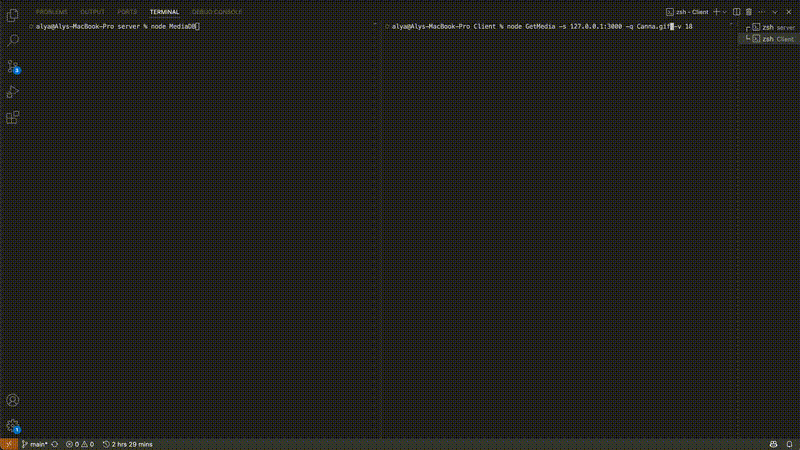

# Client/Server Media Viewer



## Overview
This project is a client-server application built using Node.js. 

The server provides a remote media management system where clients can request images or videos, download them, and display them using the default media viewer of their operating system. 

The application follows a custom protocol, called the Media Transport Protocol (MTP), for packetized media transfer.

## Features
- **Asynchronous Media Server**: Handles multiple client requests concurrently.
- **Custom Protocol (MTP)**: Implements a structured packet format for communication.
- **Client Request Handling**: Clients can query the server for media files.
- **Media Streaming**: Transfers media files efficiently using packetized communication.

## Installation
### Prerequisites
Ensure you have the following installed:
- [Node.js (LTS Version 22.14.0)](https://nodejs.org/)
- npm (Node Package Manager)

### Setup
1. Clone this repository:
   ```sh
   git clone https://github.com/yourusername/media-viewer.git
   cd media-viewer
   ```
2. Install dependencies:
   ```sh
   npm install
   ```

## Usage
### Running the Server
Start the media management server:
```sh
node MediaDB
```
The server will initialize a TCP socket, print its ephemeral port number, and begin listening for client connections.

### Running the Client
To request a media file from the server, run:
```sh
node GetMedia -s <serverIP>:<port> -q <media_name> -v 18
```

Example:
```sh
node GetMedia -s 127.0.0.1:3000 -q Rose.gif -v 18
```

Here `-s` is the IP and port of the server, `-q` is the query (filename), and `-v` is the protocol version number. 

> Note: only version 18 is implemented.

## Protocol Specification (MTP)
MTP packets include:
- **Version** (4-bit)
- **Response Type** (3-bit: Query, Found, Not Found, Busy)
- **Sequence Number** (26-bit)
- **Timestamp** (32-bit)
- **Payload Size** (31-bit)
- **Payload Data** (Media content)

## Testing
1. Run the server:
   ```sh
   node MediaDB
   ```
2. Run the client to request a media file:
   ```sh
   node GetMedia -s 127.0.0.1:3000 -q Rose.gif -v 18
   ```
3. The requested media file should be displayed using the default viewer.

Aly Ashour - 2025
